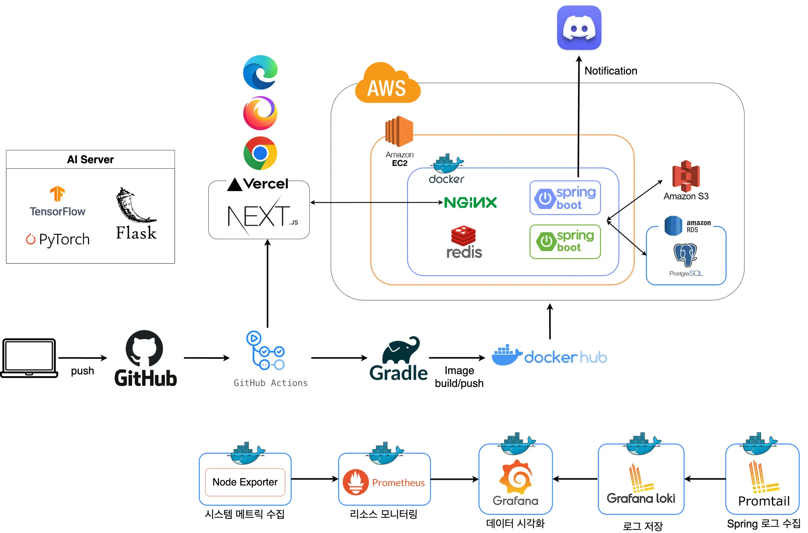
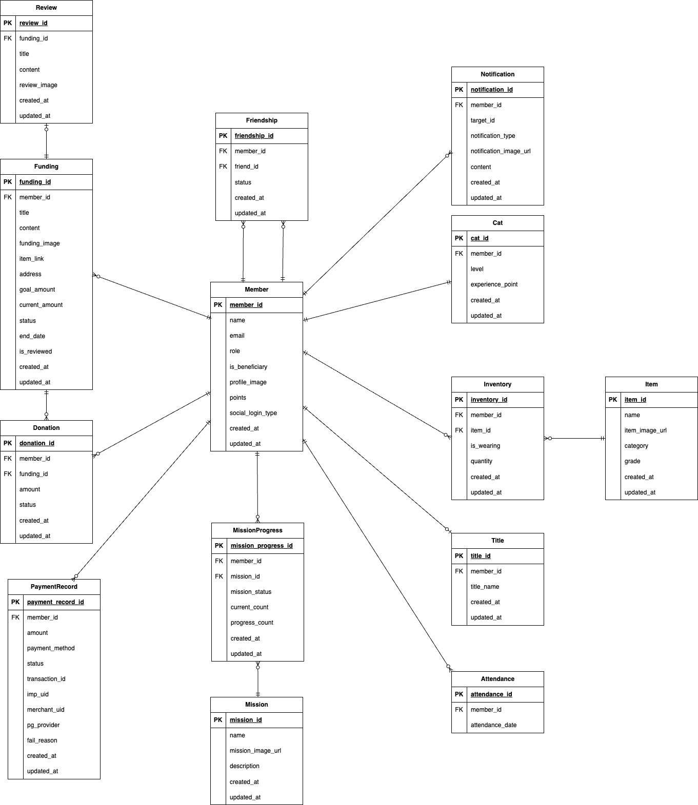

# 🐱 Chaeum Backend Repository
2025-Advanced-Capstone for BackEnd Repository [Chaeum]

---

## 📌 개요
Chaeum은 **기부의 새로운 패러다임을 제시하는 플랫폼**입니다.  
기존의 기부 시스템은 **빈곤 포르노** 방식(자극적인 연출을 통한 기부 유도)에 의존하는 경우가 많습니다.  
우리는 기부자와 수혜자가 모두 부담 없이 기부에 참여할 수 있도록 **게이미피케이션**을 적용한 **크라우드 펀딩 기반 기부 서비스**를 제공합니다.

---

## 🎯 Chaeum의 목표
1️⃣ 자극적인 콘텐츠 없이도 기부의 가치를 전달
2️⃣ 게이미피케이션 요소를 통해 지속적인 참여를 유도
3️⃣ 기부금 사용 내역의 투명한 공개를 통한 신뢰성 확보
4️⃣ 수혜자가 원하는 물품을 직접 선택하여 기부가 이루어지도록 개선

---

## 🛠️ 주요 기능

| 🏷️ 카테고리  | 🛠️ 기능 설명                        |
|-------------|----------------------------------|
| **회원**      | 소셜 로그인, 회원가입, 프로필 관리             |
| **고양이**     | 고양이 캐릭터 꾸미기                      |
| **기부**      | 기부 내역 조회 및 관리, 펀딩 참여             |
| **펀딩**      | 수혜자 인증 시 펀딩 개설 가능                |
| **친구**      | 친구 추가, 친구 상태 확인 및 관리             |
| **아이템**     | 고양이 커스터마이징 아이템 랜덤 보상             |
| **미션**      | 일일 미션 수행 및 보상 획득                 |
| **알림**      | 펀딩 완료, 친구 요청 등 주요 이벤트 발생 시 알림 제공 |
| **출석**      | 오늘 출석 체크 및 월별 출석 현황 조회           |
| **결제**      | 기부 및 포인트 사용, 카카오페이 등 결제 지원       |
| **칭호**      | 기부 횟수에 따른 칭호 부여                  |
| **리뷰**      | 펀딩 및 기부 활동에 대한 리뷰 작성 및 관리        |

---

## 📂 프로젝트 구조
```plaintext
chaeum-api
 ├── .github/                     # GitHub 관련 설정
 ├── .gradle/                     # Gradle 빌드 관련 파일
 ├── .idea/                       # IntelliJ 프로젝트 설정 파일
 ├── build/                       # 빌드된 파일
 ├── docs/                        # 문서에 사용되는 자료
 ├── gradle/                      # Gradle 래퍼 관련 파일
 ├── out/                         # 컴파일된 클래스 파일
 ├── src/
 │   ├── main/
 │   │   ├── java/com/chaeum/api/
 │   │   │   ├── domain/             # 도메인별 계층 구조
 │   │   │   │   ├── controller/     # API 컨트롤러
 │   │   │   │   ├── dto/            # 데이터 전송 객체
 │   │   │   │   ├── entity/         # JPA 엔티티 클래스
 │   │   │   │   ├── repository/     # 데이터베이스 인터페이스
 │   │   │   │   ├── service/        # 비즈니스 로직 처리
 │   │   │   ├── global/             # 공통 모듈 및 전역 설정
 │   │   │   │   ├── auth/           # JWT 인증/인가 관련 로직
 │   │   │   │   ├── config/          # 스프링 설정 클래스
 │   │   │   │   ├── entity/         # 공통 엔티티 클래스
 │   │   │   │   ├── exception/      # 전역 예외 처리 클래스
 │   │   │   │   ├── file/            # 파일 처리
 │   │   │   │   ├── filter/          # 인증/로깅 등 서블릿 필터
 │   │   │   │   ├── handler/        # 전역 예외 핸들러
 │   │   │   │   ├── pagination/     # 페이지네이션 처리
 │   │   │   │   ├── properties/     # 커스텀 application.yml 설정 매핑
 │   │   │   │   ├── response/       # 표준 API 응답 포맷 클래스
 │   │   │   │   ├── utils/          # 공통 유틸리티 클래스
 │   │   │   ├── ChaeumApiApplication.java     # 메인 애플리케이션 실행 파일
 │   │   ├── resources/
 │   │   │   ├── static/             # 정적 리소스
 │   │   │   ├── templates/          # 템플릿 파일
 │   │   │   ├── application.yml.template       # 환경 설정 템플릿
 ├── .gitattributes
 ├── .gitignore
 ├── build.gradle
 ├── gradlew
 ├── gradlew.bat
 ├── HELP.md
 ├── README.md
 ├── settings.gradle
```

---

## 🖥️ 시스템 아키텍처 다이어그램



---

## 🗂️ ERD (Entity Relationship Diagram)



---

## 👥 기여자

|                     **Minsang22Kim**                     |                     **SongJaeHoonn**                     |
|:--------------------------------------------------------:|:--------------------------------------------------------:|
|  |  |
|                         **김민상**                          |                         **송재훈**                          |
